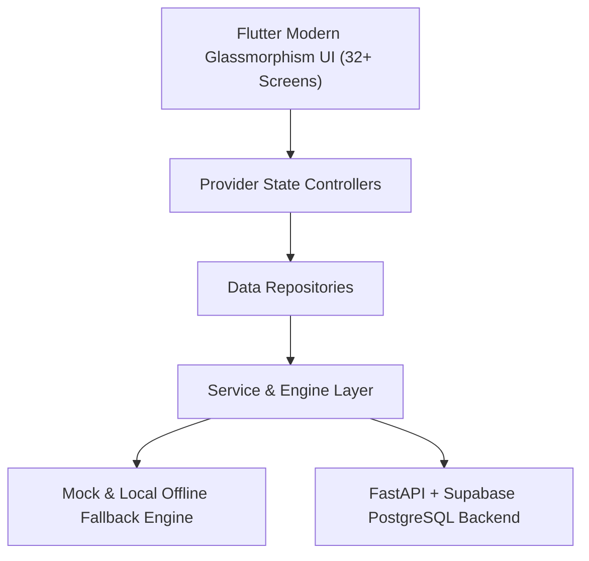

# RiderMate 2.0 — System Architecture

## Overview
Ridermate 2.0 is built on a clean 4-tier decoupled architecture designed for high telemetry precision, state reactive UI, and modular service integration.

## Layers & Responsibilities
1. **Presentation Layer (UI)**: Pure Flutter widgets styled with Circuit Orange `#FF6B00` & dark glassmorphism.
2. **State Management (Controllers)**: Reactive `ChangeNotifier` controllers extending `BaseController`.
3. **Repository Layer**: Abstraction layer guaranteeing seamless zero-downtime transition from offline/mock to live backend API.
4. **Service Engine Layer**: Math engines (Haversine telemetry, Crash Detection heuristics, OpenWeather client, AI Prompt Builder).
